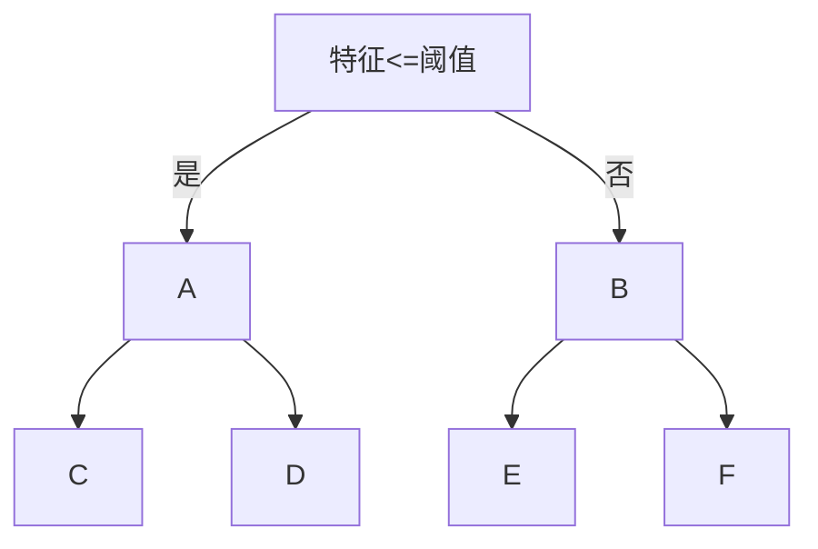

# 二叉树示例

### 使用 Mermaid 绘制二叉树

```mermaid
graph TD
    Root["特征<=阈值"] 
    Root -->|是| Left["A"] 
    Root -->|否| Right["B"] 
    Left --> LL["C"] 
    Left --> LR["D"] 
    Right --> RL["E"]
    Right --> RR["F"]
```